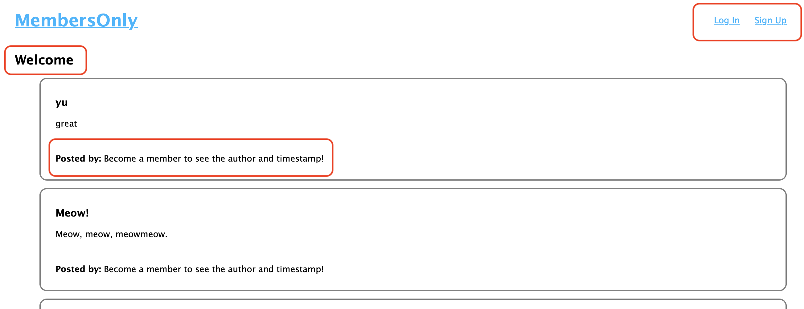
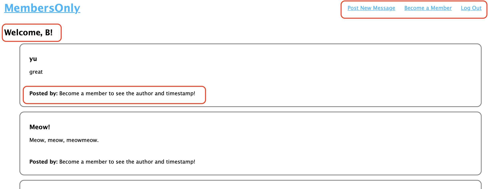
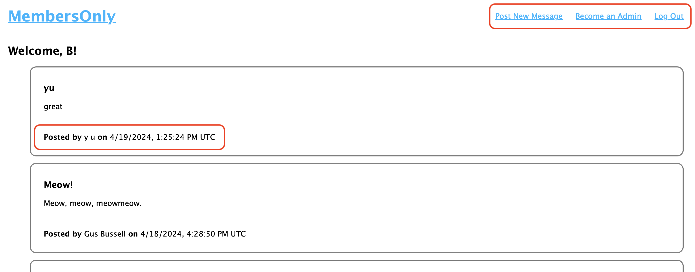
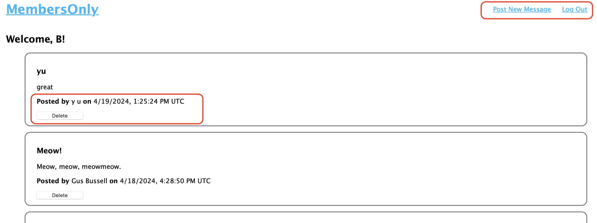

# Members Only

A Node.js and Express-based message board application that allows registered users to post messages and includes extra permission for verified members and admins.

## Description

This project demonstrates authentication and authorization using Passport.js. The permissions include:

- Anyone can register and login to post new messages to the message board.
- Only "members" can view the author and timestamp on messages
- Only "admins" can delete messages.

Additionally, it uses view templates in Pug (formerly Jade) to serve up the web pages and features secure password storage using bcryptJS.

## Table of Contents

- [Description](#description)
- [Screenshot](#screenshot)
- [Preview](#preview)
- [Features](#features)
- [Installation](#installation)
- [Usage](#usage)
- [Tech Stack](#tech-stack)
- [License](#license)
- [Contact Information](#contact-information)

## Screenshot

### Logged Out View



### Logged In View



### Member View



### Admin View



## Preview

You can view a live preview of the page [here](https://members-only-bb.fly.dev/messages). Use the key "MembersOnly" to become a member!

## Features

- User registration and login
- Authentication by JWT w/ RS256 asymmetric algorithm
- Conditional rendering using Pug view templates
- Post creation restricted to authenticated users
- Timestamp and author viewing restricted to "members"
- Message deletion restricted to "admins"
- Secure password storage with bcrypt

## Installation

1. Clone the repository:
   ```sh
   git clone https://github.com/sourdoughbredd/members-only.git
   ```
2. Navigate to the project directory:
   ```sh
   cd members-only
   ```
3. Install dependencies:
   ```sh
   npm install
   ```
4. Configure environment variables. You will need the following environment variables (in a .env file) to run the app:
   ```sh
   MONGODB_URI="your MongoDB connection string"
   JWT_PUBLIC_KEY_BASE64="the public key for decoding JWT with RS256 asymmetric algo"
   JWT_PRIVATE_KEY_BASE64="the private key for signing JWT with RS256 asymmetric algo"
   MEMBER_KEY="a key users enter to become a member"
   ADMIN_KEY="a key users enter to become an admin"
   ```
5. Start the application:
   ```sh
   npm start
   ```

## Usage

1. Register as a new user.
2. Log in with your credentials.
3. Create a post.
4. Become a member by entering the secret key
5. Become an admin by entering the secret key

## Tech Stack

- NodeJS + Express
- PassportJS
- MongoDB + Mongoose
- Pug (formerly Jade)
- CSS

## License

This project is licensed under the MIT License.

## Contact Information

For any questions or suggestions, please contact Brett Bussell at [bwbussell24@gmail.com](mailto:bwbussell24@gmail.com).
